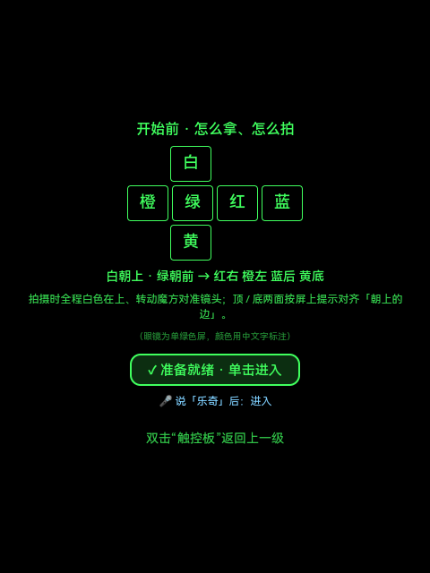
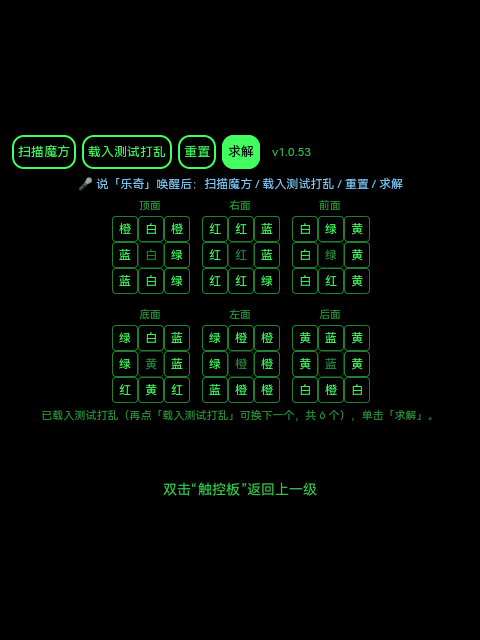
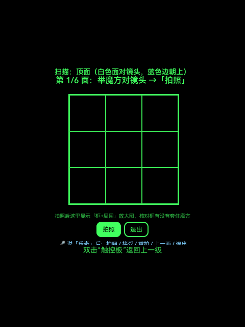
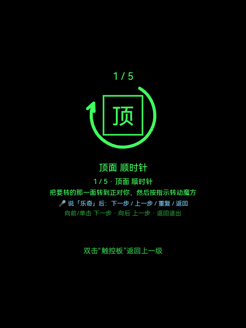
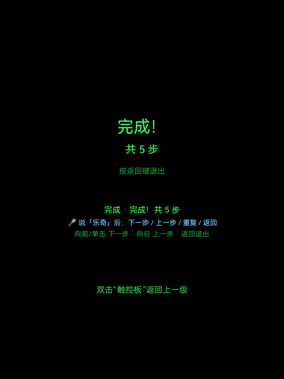

<div align="center">

# 🧊 魔方还原助手 · Cube Coach

**Rokid AR 眼镜上的新手魔方还原教练**

摄像头扫一圈六面 → 自动算近最优解 → HUD 箭头一步步带你拧回还原态，全程可语音操控。

<sub>AIUI standalone agent · 单绿 Micro-LED 眼镜 · 本地 min2phase 求解 · 离线判色 · 唤醒词语音</sub>

</div>

---

## 📸 长这样

<table>
<tr>
<td align="center" width="25%"><br><b>① 启动页</b><br><sub>图示怎么拿 / 怎么拍<br>顺便预热求解器</sub></td>
<td align="center" width="25%"><br><b>② 首页</b><br><sub>六面色块网格<br>逐格可改 + 校验</sub></td>
<td align="center" width="25%"><br><b>③ 扫描</b><br><sub>逐面取景判色<br>带唯一朝向提示</sub></td>
<td align="center" width="25%"><br><b>④ 引导</b><br><sub>面字母 + 旋转箭头<br>一步步还原</sub></td>
</tr>
</table>

> 真机（Rokid RG-glasses，480×640 单绿屏）实拍截图。配色只能用中文字标注（屏幕仅绿色）。

---

## ✨ 功能亮点

- 🎥 **摄像头扫六面**——逐面 `takePhoto`，**局部精修定位**魔方面（`locateCubeLocal`，自测试调优 IoU≈0.86），9 格采样判色（圆周色相 + 红/橙同面细分）。
- 🧭 **每面唯一正确朝向提示**——顶=白对镜头·**蓝边朝上**、底=黄对镜头·**绿边朝上**、四侧=对镜头·**白色在上**。拍错朝向会"颜色对但拼不出可解魔方"，所以这步很关键。
- 👀 **所见即所得复核**——拍完把"框+周围"放大铺满屏，核对框有没有套住魔方；可逐格手动改色，确认的格子置信度直接 100%。
- ⚡ **近最优秒解**——内置 **min2phase**（Kociemba 两阶段，约 20 步）。剪枝表在启动页预热好，进首页后求解即时出。
- 🧑‍🏫 **新手向导**——引导页画「面字母 + 旋转箭头 + 步数」，每步提示「**把要转的那一面转到正对你，然后按指示转动魔方**」，彻底解决顺/逆时针看晕的问题。
- 🎙️ **唤醒词语音**——每页说「**乐奇**」唤醒后说命令：启动页`进入`；首页`扫描/打乱/重置/求解`；扫描页`拍照/接受/重拍/上一面/退出`；引导页`下一步/上一步/重复/返回`。
- ✋ **极简交互**——硬件只有 向前 / 向后 / 单击 / 双击，单轴环形导航，中心格锁定且自动跳过。

---

## 🎬 一条龙流程

```
启动页（握法 + 预热）──单击/「进入」──▶ 首页（六面网格）
        │
        ├─「扫描魔方」▶ 逐面取景→拍照→判色→复核→接受 ×6 ▶ 回首页回填，逐格核对
        │
        └─「求解」▶ 引导页：1/N 面字母+箭头，逐步「下一步」直到 ✅ 完成
```

<div align="center"><br><sub>✅ 完成！共 N 步</sub></div>

> 没有魔方也能体验：首页「**载入测试打乱**」一键填入已知打乱（6 个由易到难循环），直接「求解」看引导。

---

## 🧠 为什么是 min2phase

> ⚠️ 不用 cubejs(Kociemba) 的运行时 `initSolver` —— 它在浏览器 / rquickjs 运行时构建百万级剪枝表会**同步冻屏数十秒**；也弃用 CFOP(rubiks-cube-solver, 50–130 步)。
> **min2phase**：步数近最优（~20）、稳态 <1ms，唯一的建表开销（端侧约 1–4s）被挪到**启动页预热**，用户读"怎么拿/怎么拍"的时间正好盖掉。

## 📱 硬件约束（Rokid 眼镜 / QuickJS）

- 运行时是 **QuickJS**：无 Worker、无 WASM、无 JIT，重型同步运算会冻屏。
- 相机**仅 `takePhoto`**（无视频流），无端侧 ML → 判色全靠本地 CV。
- 交互只有 向前 / 向后 / 单击 / 双击 + 唤醒词语音；**双击 = 系统级返回上一级**（系统弹栈，App 不再 `navigateBack`）。
- 语音：系统「乐奇」助手常驻占麦，纯连续听不可行 → 用**唤醒词触发**单次识别（`onVoiceWakeup` → 听一条命令）。

## 🗂 项目结构

```
app.json / app.js / AGENTS.md / package.json
lib/cube.js                颜色↔面字母映射 / 校验 / 烘焙测试打乱网格
lib/solver.js              solve(grid)=min2phase / scrambledGrid / warmup 预热
lib/vendor/min2phase.js    Kociemba 两阶段求解器（cs0x7f/cstimer 源）
lib/moves.js               走步串 → 新手步骤文案
lib/colors.js              locateCubeLocal 定位 / sampleFace 采样 / classifyByAnchorsHue 判色 / refineRedOrange 红橙细分
lib/webp.js, lib/vendor/webpjs/   webp 解码（typed-array 优化，真机摄像头帧）
lib/png.js / lib/jpeg.js   PNG / JPEG 解码（兜底）
lib/voice.js               唤醒词语音命令控制器（onVoiceWakeup → 单次识别 → 命中短语执行）
pages/entry/index.ink      启动页（握法/拍摄说明 + 预热求解器 + 单击进入；app.json 首项=入口）
pages/input/index.ink      首页 / 输入页
pages/scan/index.ink       扫描页（摄像头采集 + 判色复核）
pages/guide/index.ink      引导页（HUD 分步动画）
docs/                      产品设计 / 硬件与 API 参考 / 真机自动化测试流程 等
```

## 🎨 标准配色（固定，中心锁定）

白顶(U) · 黄底(D) · 绿前(F) · 蓝后(B) · 橙左(L) · 红右(R)。

## 🛠 运行 / 调试

真机部署与自动化测试流程见 [`docs/真机自动化测试流程.md`](docs/真机自动化测试流程.md)（adb push 到 runtime 目录 + keyevent 驱动 + logcat / screencap 观测）。PC 预览可用 AIUI CLI / Craft 网页工作台导入本目录。

**PC 主路径（不依赖摄像头/语音）**
1. 启动页等「✓ 准备就绪」后 **单击进入** 首页（求解器已预热）。
2. 首页点 **「载入测试打乱」** → 网格填入已知打乱（免手输 54 格）。
3. 点 **「求解」**（已预热，秒出）→ 跳转引导页。
4. 引导页 **下一步** 逐步走到「完成」，**上一步** 回退。
5. 校验分支：手动把某格改成非法颜色再「求解」，应高亮报错且不跳转。

## ✅ 已验证

`selfTest`（对测试打乱求解）PASS；min2phase 解经裁判交叉验证 `isSolved=true`；颜色映射 / 校验 / 走步解析全部 PASS；定位算法在标注帧上 IoU≈0.86（95% ≥0.7）；webp 解码 typed-array 优化后真机提速约 33%；真机实测 happy-path（启动→载入打乱→求解→引导→完成）跑通；全部 `.ink`/`.js` 通过语法检查。

## 🚧 待迭代

- 同色面（多面同中心色）消歧。
- 语音稳定性：系统「乐奇」助手占麦，唤醒后单次识别偶被系统会话 `abort`（连说唤醒会自我打断）；待加"识别中忽略重复唤醒"保护。
- 层先法(LBL)分阶段教学（替换/叠加 `lib/solver.js` + 引导页阶段讲解）。
